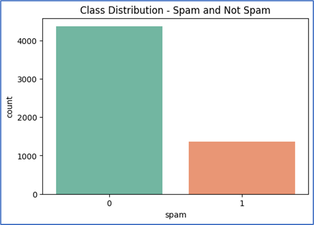

# 📧 Spam Email Classifier – Advanced NLP with Balanced Sampling

A robust **Spam Email Classification System** that leverages **Natural Language Processing (NLP)** and **Machine Learning** techniques to distinguish spam from legitimate emails.  
This project meticulously explores two data balancing strategies: **Random Downsampling** and **SMOTE (Synthetic Minority Oversampling Technique)**, evaluating their impact on classification performance.

---

## 🚀 Project Highlights
- 🔎 **Exploratory Data Analysis (EDA):** Clear visualization of spam vs. ham email distributions.  
- 🧹 **Data Preprocessing:** Text cleaning and **TF-IDF vectorization** using `scikit-learn`.  
- ⚖️ **Class Balancing Strategies:**  
  - 📉 **Random Downsampling**
    * Reducing Majority class samples to achieve balance.
    *  Matched with Minor class, 1368 per each.
  - 🔬 **SMOTE**
    * Generating synthetic Minority class samples for balance.
    *  Synthetically geberated and matched with Major class 4360 per each
- 🤖 **Machine Learning Model:** Logistic Regression trained on TF-IDF features.  
- 📊 **Evaluation Metrics:** Accuracy, Precision, Recall, F1-score, ROC-AUC, and Confusion Matrix visualizations.

---


```
Class Imbalance between Spam & Not-Spam categories
```
---

## 🛠️ Tech Stack
- **Languages:** Python 🐍  
- **Libraries:** Pandas, NumPy, scikit-learn, spaCy, Imbalanced-learn, Matplotlib, Seaborn  
- **Notebook Environment:** Jupyter
- **IDE:** Visual Studio Code with Anaconda Distribution

---

## 📂 Repository Structure
``` text
Project_02_Spam_Email_Classifier_Infotech
|
├── 1_data/
│    ├── email.csv
│    ├── validation_dataset.csv
|
├── 2_notebooks/
│    ├── project_02_spam_email-classifier_F_downsampled.ipynb # Downsampling approach
│    ├── project_02_spam_email-classifier_F_SMOTE.ipynb # SMOTE approach
|    ├── requirements.txt # Dependencies
|
├── 3_models/
│    ├── spam_email_classifier_model_downsampled.h5
│    ├── spam_email_classifier_model_smote.h5
|
├── 4_visualizations/
│    ├── 1_test_data/
│           ├── Classification reports, confusion matrices, Accuracy, Precision, Recall, F1_Scores
│    ├── 2_validation_data/
│           ├── Classification reports, confusion matrices, Accuracy, Precision, Recall, F1_Scores
|
├── LICENSE.md # MIT License
└── README.md # Project documentation
```

---

## ⚖️ Model Comparison

| Method        | Strengths ✨                                    | Weaknesses ⚠️                                  | Best Use Case |
|---------------|-----------------------------------------------|-----------------------------------------------|---------------|
| **Downsampling** | Fast, avoids synthetic data bias | Data loss, weaker performance on small datasets | When dataset is very large |
| **SMOTE**        | Retains all data, balances intelligently   | Risk of overfitting, slower on big data        | When dataset is imbalanced but limited |

---

## 📈 [Results Snapshot](4_visualizations)

📊 Detailed confusion matrices, classification reports, and performance tables are in the [notebooks](2_notebooks) & [visualizations](4_visualizations)


---

## ⚡ Quick Start
1. Clone the repository  
   ```bash
   git clone https://github.com/ThilinaPerera-DataAnalytics/Project_02_Spam_Email_Classifier_Infotech.git
   cd Project_02_Spam_Email_Classifier_Infotech
2. Install dependencies
    ```bash
    pip install -r requirements.txt
3. Launch Jupyter Notebook
    ```bash
    jupyter notebook
4. Open either:
    ```
    * [project_02_spam_email-classifier_F_downsampled.ipynb](2_notebooks\project_02_spam_email-classifier_F_downsampled.ipynb)
    * [project_02_spam_email-classifier_F_SMOTE.ipynb](2_notebooks\project_02_spam_email-classifier_F_SMOTE.ipynb)
---
## 🔮 Future Enhancements
* Integration with Transformers (BERT, DistilBERT) for state-of-the-art NLP.
* Deployment as a Flask/FastAPI web service.
* Interactive Streamlit dashboard for real-time spam detection.
* Model monitoring with MLflow.
* Add unit tests and CI/CD pipelines.

## 📚 Dataset
- **Source:** [Kaggle Spam Email Dataset](https://www.kaggle.com/datasets/jackksoncsie/spam-email-dataset)   
- **Size:** ~5728 email samples  
- **Labels:**  
  - `1` → Spam  
  - `0` → Not Spam (Ham) 

### 👨‍💻 Author - [Thilina Perera](https://github.com/ThilinaPerera-DataAnalytics)
    📌 Data Analytics Enthusiast | Machine Learning, Deep Learning, & NLP Explorer
    
### 🔗 [LinkedIn Profile](https://www.linkedin.com/in/thilina-perera-148aa934/)

### 💻 [GitHub](https://github.com/ThilinaPerera-DataAnalytics) 

### 🏆 License
    This project is licensed under the MIT License – free to use and extend.
---